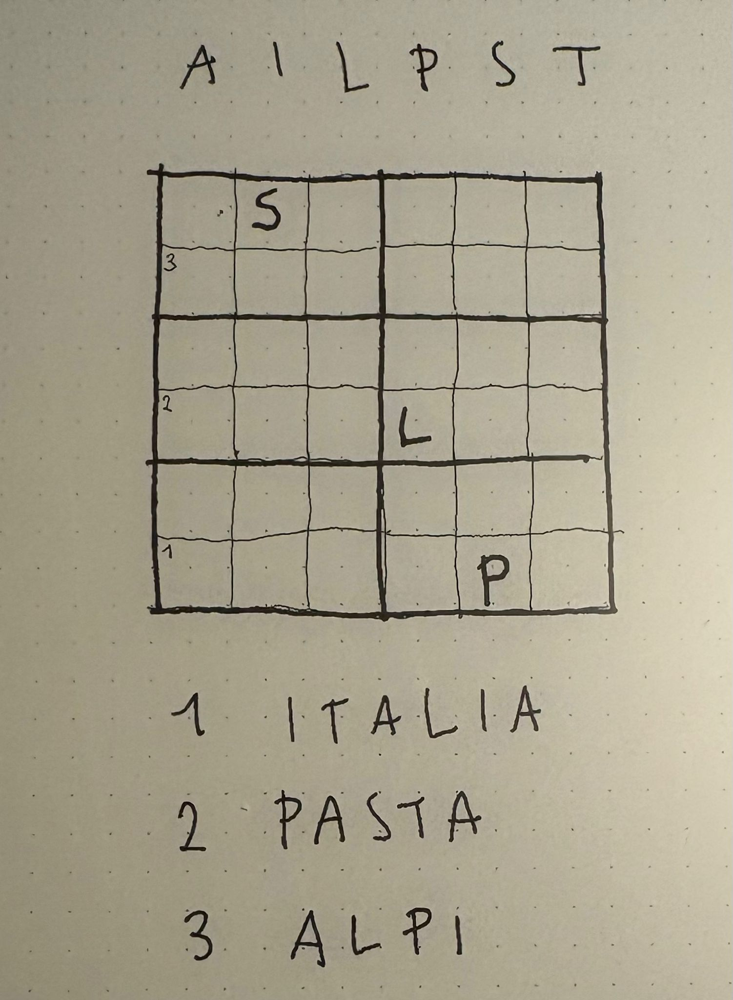
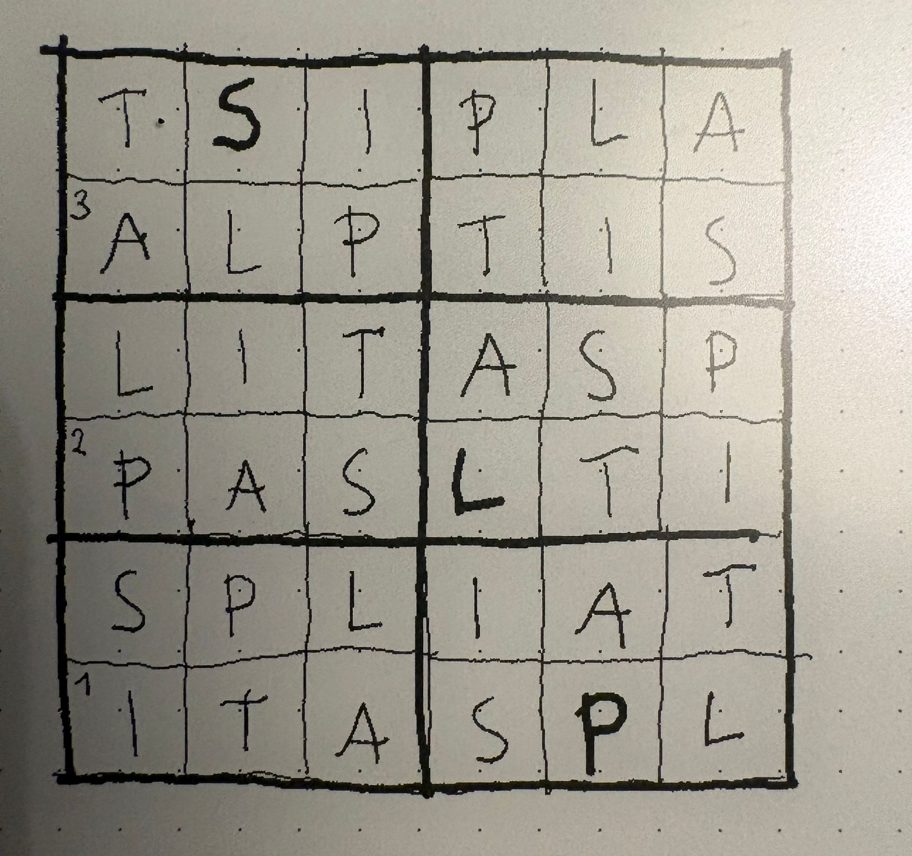

# Puzzlepaw

A collection of small tools for crafting logic puzzles, written in
[Nim](https://nim-lang.org).

## Motivation

After spending time solving logic puzzles — inspired by Thomas Snyder's work on
[Grand Master Puzzles](https://www.gmpuzzles.com) — I started designing puzzles
by hand. That manual process taught me the craft. Now I want to build lightweight
tools to support the creative side of puzzle construction: validating grids,
checking constraints, and exploring variations faster than pen and paper allow.

This project grows incrementally. Each tool solves one small, concrete problem
in the puzzle-making workflow. It also doubles as a first experiment with
[Claude Code](https://claude.ai/claude-code) as a development companion.

## Parloku

Parloku is a mini sudoku variant that uses letters instead of numbers and
adds word-based hints as an extra layer of deduction.

### Rules

1. Fill a 6x6 grid with six distinct letters so that each letter appears
   exactly once in every row, column, and 2x3 box — standard sudoku rules.
2. A list of words is provided alongside the grid. Each word has a numbered
   starting cell marked in the grid.
3. Starting from that cell, the word is spelled out step by step, moving
   horizontally or vertically to an adjacent cell at each step.

Some cells may contain pre-filled letters as additional givens.

### Example

In this example the six letters are **A, I, L, P, S, T** and the word hints
are ITALIA, PASTA, and ALPI — all Italian words, reflecting the puzzle's
Italian origin.



<details>
<summary>Show solution</summary>



</details>

### Playtest TUI

A terminal-based player is included for playtesting puzzles. Run it with:

```sh
nim play
```

The TUI displays the puzzle grid with colored word hint markers. Use arrow
keys to navigate, type a letter to place it, and backspace to clear.

```text
Letters: A I L P S T

+-------+-------+
| . S . | . . . |
| 3 . . | . . . |
+-------+-------+
| . . . | . . . |
| 2 . . | L . . |
+-------+-------+
| . . . | . . . |
| 1 . . | . P . |
+-------+-------+

Word hints:
  1. ITALIA
  2. PASTA
  3. ALPI
```

## Claude session logs

This project is developed with [Claude Code](https://claude.ai/claude-code).
Session logs are kept in the [claude/](claude/) folder, documenting what was
built, decisions made, and lessons learned in each session.
